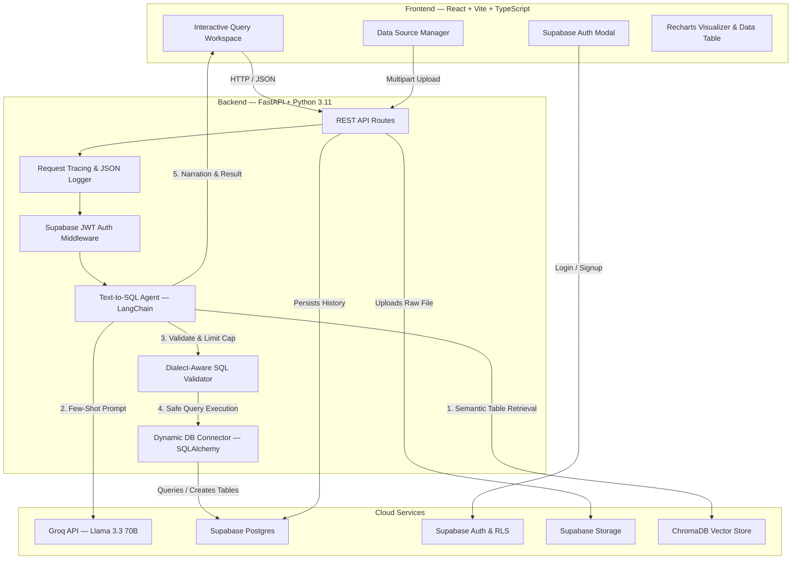

# 🧠 QueryMind

> A production-ready, cloud-native QueryMind platform that turns natural language questions into safe, dialect-aware SQL queries — executes them against dynamic user databases or uploaded CSV/XLSX files — and presents insights with AI narration and interactive visualizations.


---

## 📸 Demo

> **Coming soon** — Add a screenshot or GIF of the running app here.

---

## 🏛️ Architecture



---

## ✨ Key Features

### Dynamic Ingestion & Multi-Source Support
- **Zero local disk dependency** — uploaded CSV/XLSX files are parsed in-memory, backed up to Supabase Storage, and ingested into a dedicated `user_data` schema in Supabase Postgres.
- **External DB connections** — connect external PostgreSQL or MySQL databases via connection URI.
- **Namespaced vector storage** — each data source gets an isolated ChromaDB collection (`src_<uuid>`) to prevent cross-dataset context contamination.

### SQL Validation & Hardening Pipeline
- **Multi-dialect aware** — formats queries for SQLite, PostgreSQL, or MySQL.
- **Strict operation blocklist** — blocks DDL/DML writes (`DROP`, `DELETE`, `UPDATE`, `INSERT`, `ALTER`, `TRUNCATE`, etc.).
- **Runaway query cap** — automatically injects `LIMIT 10000` to prevent memory blowouts.
- **Injection protection** — blocks stacked queries, comment injection, and enforces statement-level timeouts.

### Self-Correction & AI Narration
- **Retry loop** — if a generated query fails validation or triggers a runtime error, the agent re-prompts the LLM with the error traceback (up to 3 retries).
- **AI narration** — explains tabular results in plain English with chart recommendation hints (`bar`, `line`, `pie`, `table`).

### Observability & Tracing
- **Structured JSON logging** — all logs formatted as JSON with ISO timestamps, levels, and request context.
- **Distributed request tracing** — every request gets a unique `X-Request-ID` returned in response headers.
- **Deep health probes** — `/health` endpoint monitors API, Groq config, Supabase, ChromaDB, and database connections.
- **Error sanitization** — detailed tracebacks logged internally; clean error messages returned to clients.

---

## 🧪 Evaluation Benchmark

An automated evaluation harness (`eval/run_eval.py`) benchmarks query generation accuracy against a 20-question suite.

```bash
python -m eval.run_eval
```

| Metric | Score |
|---|---|
| **Overall Accuracy** | 60.0% (12/20) |
| **Easy Questions** | 85.7% (6/7) |
| **Medium Questions** | 62.5% (5/8) |
| **Hard Questions** | 20.0% (1/5) |
| **Average Latency** | 1,922 ms |

---

## 🚀 Getting Started

### Prerequisites

| Requirement | Details |
|---|---|
| **Docker & Docker Compose** | Required for containerized deployment |
| **Node.js** | v22+ (only for local frontend development) |
| **Python** | 3.11+ (only for local backend development) |
| **Groq API Key** | Free at [console.groq.com](https://console.groq.com) |
| **Supabase Project** | Free tier at [supabase.com](https://supabase.com) |

### 1. Clone & Configure

```bash
git clone https://github.com/<your-username>/querymind.git
cd querymind
cp .env.example .env
```

Edit `.env` with your credentials (see [Environment Variables](#-environment-variables) below).

### 2. Set Up Supabase

1. Create a new project at [supabase.com](https://supabase.com).
2. Go to **SQL Editor** in the Supabase Dashboard.
3. Run the migration files **in order**:
   - `supabase/migrations/001_foundation.sql` — creates `data_sources`, `query_history`, RLS policies, and storage bucket.
   - `supabase/migrations/002_dashboards.sql` — creates `dashboards` and `dashboard_widgets` tables with RLS.
4. Copy your credentials from **Settings → API** and **Settings → Database** into your `.env` file.

### 3. Launch with Docker Compose (Recommended)

```bash
docker-compose up --build
```

| Service | URL |
|---|---|
| **React Frontend** | [http://localhost:3000](http://localhost:3000) |
| **FastAPI Docs** | [http://localhost:8000/docs](http://localhost:8000/docs) |
| **Health Check** | [http://localhost:8000/health](http://localhost:8000/health) |

### 4. Local Development (Without Docker)

<details>
<summary><strong>Backend</strong></summary>

```bash
# Create & activate virtual environment
python -m venv venv
source venv/bin/activate        # Linux/macOS
venv\Scripts\activate           # Windows

# Install dependencies
pip install -r requirements.txt

# (Optional) Set up the sample Northwind database
python data/setup_northwind.py

# Start the dev server
uvicorn backend.main:app --reload --port 8000
```
</details>

<details>
<summary><strong>Frontend</strong></summary>

```bash
cd frontend
npm install
npm run dev
```

Open [http://localhost:5173](http://localhost:5173). The Vite dev server proxies API calls to `localhost:8000`.
</details>

---

## 🔐 Environment Variables

Create a `.env` file from the template:

```bash
cp .env.example .env
```

| Variable | Required | Description |
|---|---|---|
| `GROQ_API_KEY` | ✅ | API key from [console.groq.com](https://console.groq.com) |
| `GROQ_MODEL` | ❌ | LLM model name (default: `llama-3.3-70b-versatile`) |
| `SUPABASE_URL` | ✅ | Your Supabase project URL |
| `SUPABASE_ANON_KEY` | ✅ | Supabase anon/public key |
| `SUPABASE_SERVICE_ROLE_KEY` | ✅ | Supabase service role key (backend only) |
| `SUPABASE_JWT_SECRET` | ✅ | Supabase JWT secret for token verification |
| `SUPABASE_DB_URL` | ✅ | Direct Postgres connection URI for dynamic table creation |
| `DB_PATH` | ❌ | Path to local SQLite demo database (default: `data/northwind.db`) |
| `EMBEDDING_MODEL` | ❌ | Sentence-transformer model (default: `all-MiniLM-L6-v2`) |
| `TOP_K_TABLES` | ❌ | Number of tables to retrieve via vector search (default: `3`) |
| `MAX_RETRIES` | ❌ | Self-correction retry attempts (default: `3`) |
| `RESULT_LIMIT` | ❌ | Default row limit for query results (default: `100`) |
| `QUERY_TIMEOUT_SECONDS` | ❌ | Statement timeout in seconds (default: `10`) |
| `CORS_ORIGINS` | ❌ | Comma-separated allowed origins |
| `CHROMA_URL` | ❌ | Remote ChromaDB server URL (leave blank for embedded local) |

---

## 📁 Project Structure

```
querymind/
├── .env.example              # Environment variables template
├── .gitignore                # Git ignore rules
├── docker-compose.yml        # Container orchestration
├── Dockerfile.backend        # Python FastAPI container
├── Dockerfile.frontend       # Multi-stage Node → Nginx container
├── LICENSE                   # MIT License
├── README.md
├── requirements.txt          # Python dependencies
│
├── backend/
│   ├── main.py               # FastAPI app, routes & exception handlers
│   ├── agent.py              # LangChain Text-to-SQL agent orchestration
│   ├── sql_validator.py      # Multi-dialect SQL validator & limit injection
│   ├── db_connector.py       # SQLAlchemy dynamic connector (Postgres/MySQL/SQLite)
│   ├── schema_retriever.py   # ChromaDB per-source vector indexing & retrieval
│   ├── auth.py               # Supabase JWT authentication dependency
│   ├── config.py             # Pydantic configuration loader
│   ├── logger.py             # Structured JSON logger & context-var tracing
│   └── supabase_client.py    # Supabase client singleton
│
├── frontend/
│   ├── nginx.conf            # Nginx SPA + reverse proxy config
│   ├── package.json
│   ├── vite.config.ts
│   └── src/
│       ├── App.tsx           # Main application orchestrator
│       ├── index.css         # Dark theme & glassmorphic design system
│       ├── main.tsx          # React entry point
│       ├── lib/
│       │   ├── api.ts        # Backend REST API client
│       │   └── supabase.ts   # Supabase JS client
│       └── components/
│           ├── AuthModal.tsx          # Login & registration dialog
│           ├── Dashboard.tsx          # Saved dashboard & widget viewer
│           ├── Navbar.tsx             # Navigation & health status badge
│           ├── QueryHistoryModal.tsx  # User query history drawer
│           ├── QueryWorkspace.tsx     # Search box, SQL viewer, table & charts
│           └── SourceManager.tsx      # CSV upload & DB URI connection modal
│
├── eval/
│   ├── test_cases.json       # 20-question benchmark suite
│   ├── run_eval.py           # Evaluation runner script
│   └── report.md             # Benchmark results
│
├── data/
│   ├── northwind.db          # Sample Northwind SQLite database
│   └── setup_northwind.py    # Script to (re)create the Northwind DB
│
├── embeddings/
│   └── chroma_db/            # ChromaDB vector store (generated at runtime)
│
└── supabase/
    └── migrations/
        ├── 001_foundation.sql    # Core schema, RLS policies & storage bucket
        └── 002_dashboards.sql    # Dashboard & widget tables with RLS
```

---

## ☁️ Deployment Guide

### Option 1: Railway (Recommended — Easiest)

[Railway](https://railway.app) supports Docker-based deployments with automatic builds.

**Backend:**
1. Create a new project on Railway → **New Service → GitHub Repo**.
2. Set the root directory to `/` and the **Dockerfile path** to `Dockerfile.backend`.
3. Add all required environment variables from `.env.example` in the Railway service settings.
4. Railway auto-assigns a public URL (e.g., `https://querymind-backend-xxx.up.railway.app`).

**Frontend:**
1. Add a second service in the same Railway project → **GitHub Repo**.
2. Set the **Dockerfile path** to `Dockerfile.frontend`.
3. Update `frontend/nginx.conf` — replace `proxy_pass http://backend:8000` with your Railway backend URL:
   ```nginx
   proxy_pass https://querymind-backend-xxx.up.railway.app;
   ```
4. Redeploy the frontend service.

---

### Option 2: Render (Free Tier Friendly)

**Backend — Web Service:**
1. Go to [render.com](https://render.com) → **New → Web Service → Connect your GitHub repo**.
2. Set **Environment** to `Docker`, **Dockerfile Path** to `./Dockerfile.backend`.
3. Add environment variables from `.env.example`.
4. Deploy — Render provides a public URL.

**Frontend — Static Site:**
1. **New → Static Site → Connect your GitHub repo**.
2. Set **Build Command**: `cd frontend && npm install && npm run build`
3. Set **Publish Directory**: `frontend/dist`
4. Add a rewrite rule: `/*` → `/index.html` (for SPA routing).
5. Update `frontend/src/lib/api.ts` to point `BASE_URL` to your Render backend URL.

---

### Option 3: VPS / AWS EC2 (Docker Compose)

Deploy the entire stack on any Linux VPS using Docker Compose.

```bash
# SSH into your server
ssh user@your-server-ip

# Install Docker & Docker Compose
curl -fsSL https://get.docker.com | sh
sudo apt install -y docker-compose-plugin

# Clone and configure
git clone https://github.com/<your-username>/querymind.git
cd querymind
cp .env.example .env
nano .env  # Fill in your credentials

# Launch in detached mode
docker compose up --build -d
```

**Production hardening:**
- Put an **Nginx reverse proxy** or **Caddy** in front for SSL/TLS termination.
- Update `CORS_ORIGINS` in `.env` to your domain.
- Use a process manager or `restart: always` in `docker-compose.yml`.

---

### Option 4: Vercel (Frontend) + Railway (Backend)

Best for free-tier hosting with edge CDN for the frontend.

**Frontend on Vercel:**
1. Import the repo on [vercel.com](https://vercel.com).
2. Set **Framework Preset** to `Vite`, **Root Directory** to `frontend`.
3. Add environment variable `VITE_API_URL` = your Railway backend URL.
4. Update `frontend/src/lib/api.ts` to use `import.meta.env.VITE_API_URL` as the base URL.

**Backend on Railway:**
Follow the Railway backend instructions from Option 1 above.

---

## 🎓 Engineering Decisions

Key design decisions worth highlighting:

1. **Supabase Postgres for uploaded CSVs** — Writing to dynamic schemas (`user_data.src_<id>`) centralizes persistence, removes stateless backend volume management, and enables RLS isolation.

2. **Per-source ChromaDB collections** — Namespacing collections per source (`src_<uuid>`) prevents cross-dataset context leak and allows instant deletion by dropping the collection.

3. **Defense-in-depth SQL security**:
   - **Layer 1 — Prompt Engineering**: Dialect-specific system prompts instruct the LLM to write read-only queries.
   - **Layer 2 — AST & Regex Hardening**: `sql_validator.py` enforces single `SELECT`/`WITH` statements, blocks forbidden keywords, and caps output rows.
   - **Layer 3 — Database Level**: Connection statement timeouts prevent long-running or denial-of-service queries.

4. **Self-correction resilience** — feeds execution stack traces back to the LLM up to 3 times before failing gracefully, mitigating non-determinism.

---

## 🤝 Contributing

1. Fork the repository
2. Create your feature branch (`git checkout -b feature/amazing-feature`)
3. Commit your changes (`git commit -m 'Add amazing feature'`)
4. Push to the branch (`git push origin feature/amazing-feature`)
5. Open a Pull Request

---

## 📄 License

Distributed under the MIT License. See [LICENSE](LICENSE) for details.
